# PlantscRNAdb

## 1.首页

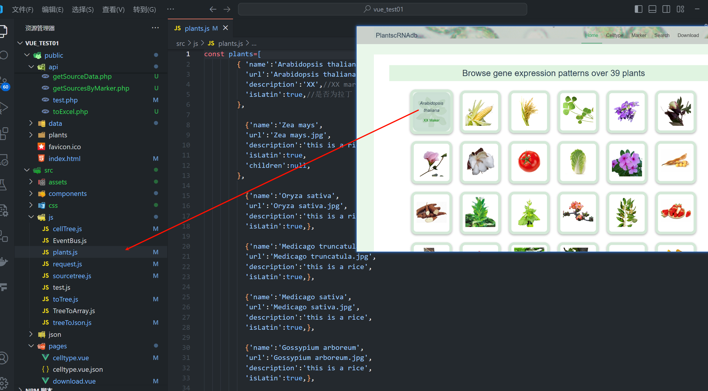

## 2.celltype页

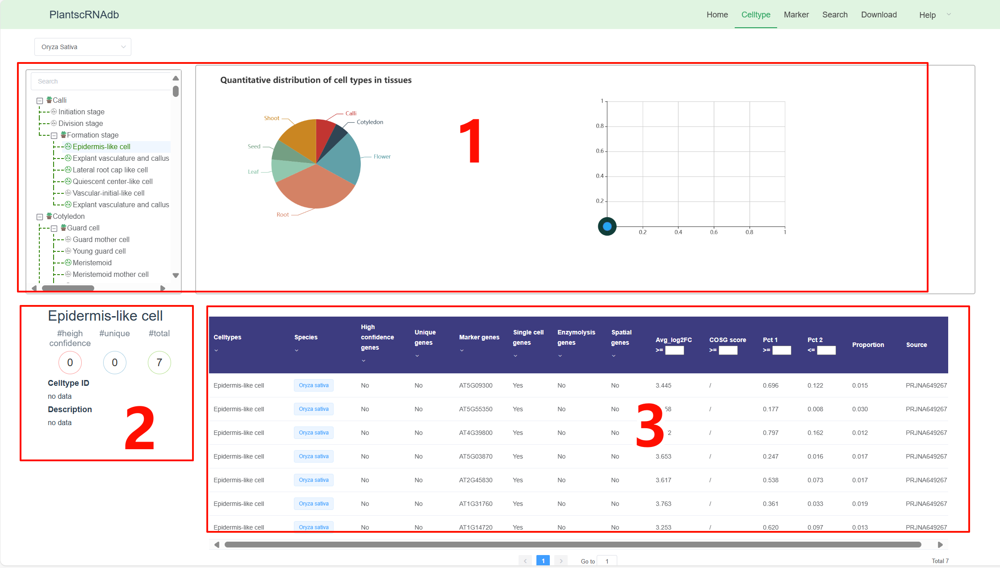

有三部分数据

### 1.树和饼图数据

提前通过数据库计算得到，保存到json文件中

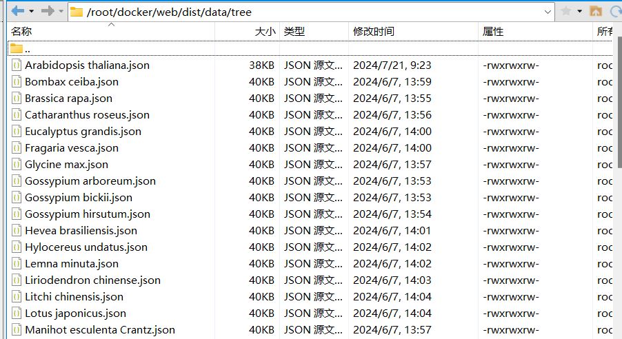

从数据库的这张表计算得来

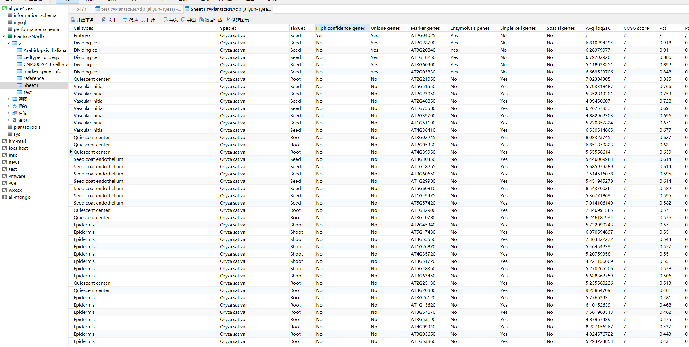

这张表里的数据从这个excel表导入

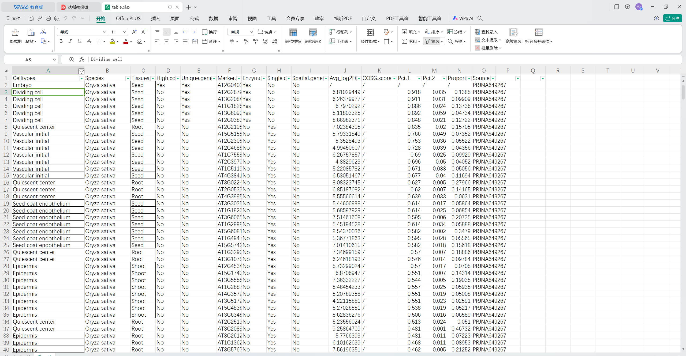

#### 树的生成方法方法

原始excel表

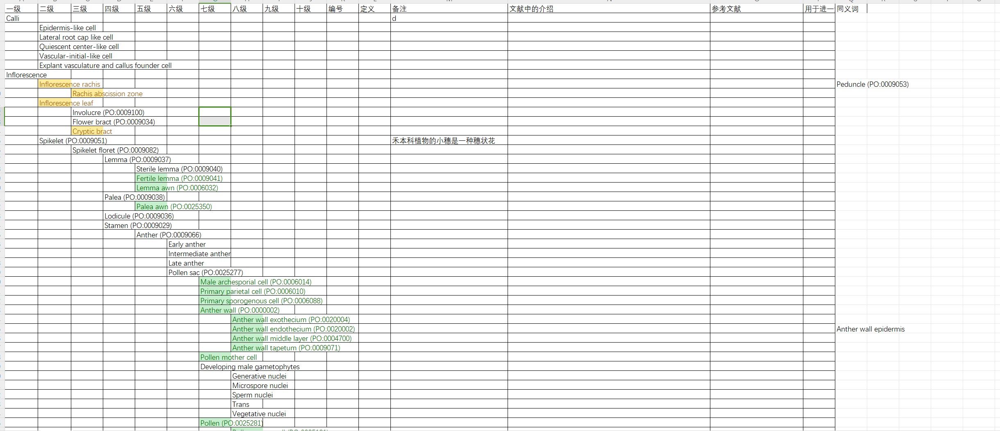

通过网站https://tableconvert.com/zh-cn/excel-to-json转成json格式

去除po号的正则表达式$(..PO:........)$

通过python代码转成树状json格式

再通过python代码从数据库中统计计算

### 2.细胞id、description，统计数据

统计数据同1

id、description来自这张表

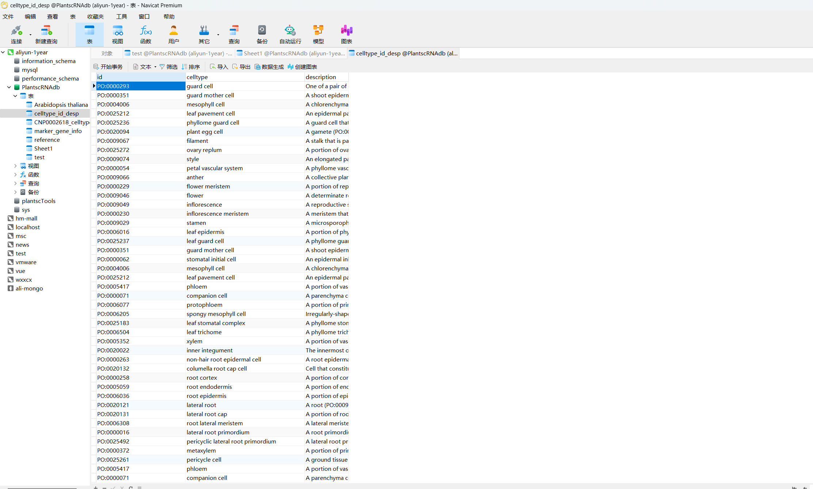

原始excel表为这张表

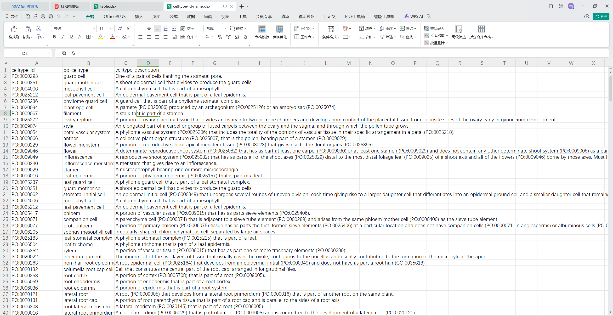

### 3.表格

和2.1是同一张数据库里的表

## 3.marker页

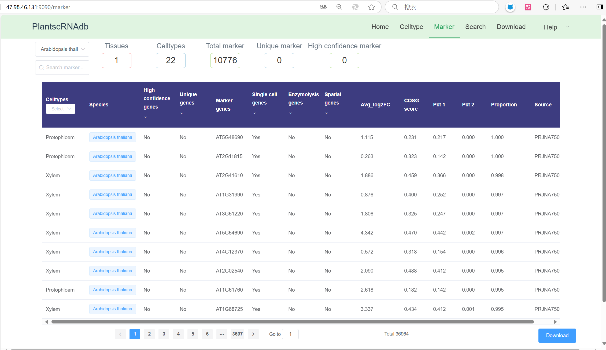

同celltype的表

## 4.细胞详情页

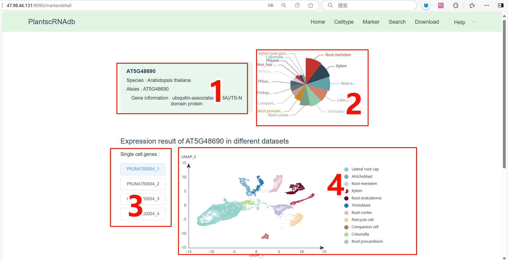

### 1.某个物种的某个基因数据

对应的数据库表如下，是从什么原始数据导入的暂未找到

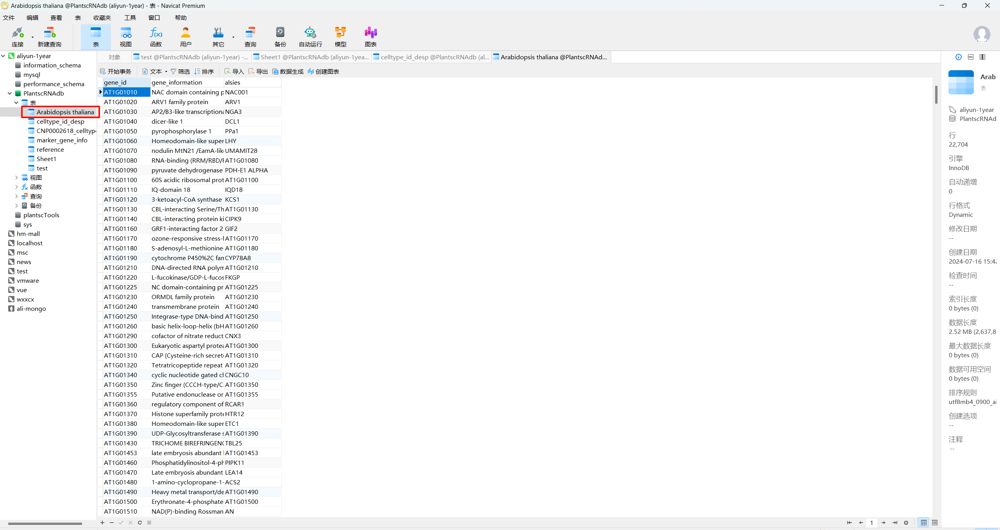

### 2.饼图数据

数据库表同2.1

### 3.有哪些表达结果（单细胞表数量和）

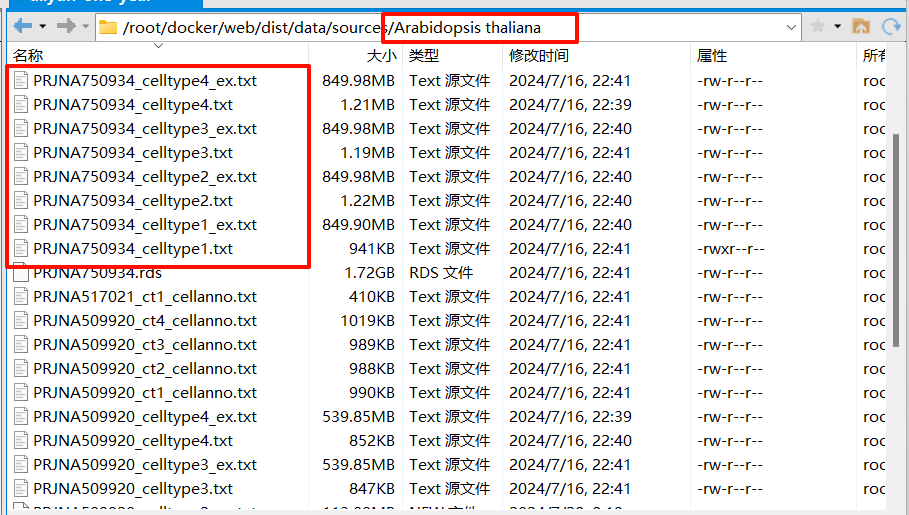

通过服务器上对应路径和文件名计算

### 4.散点图数据

来源于两部分

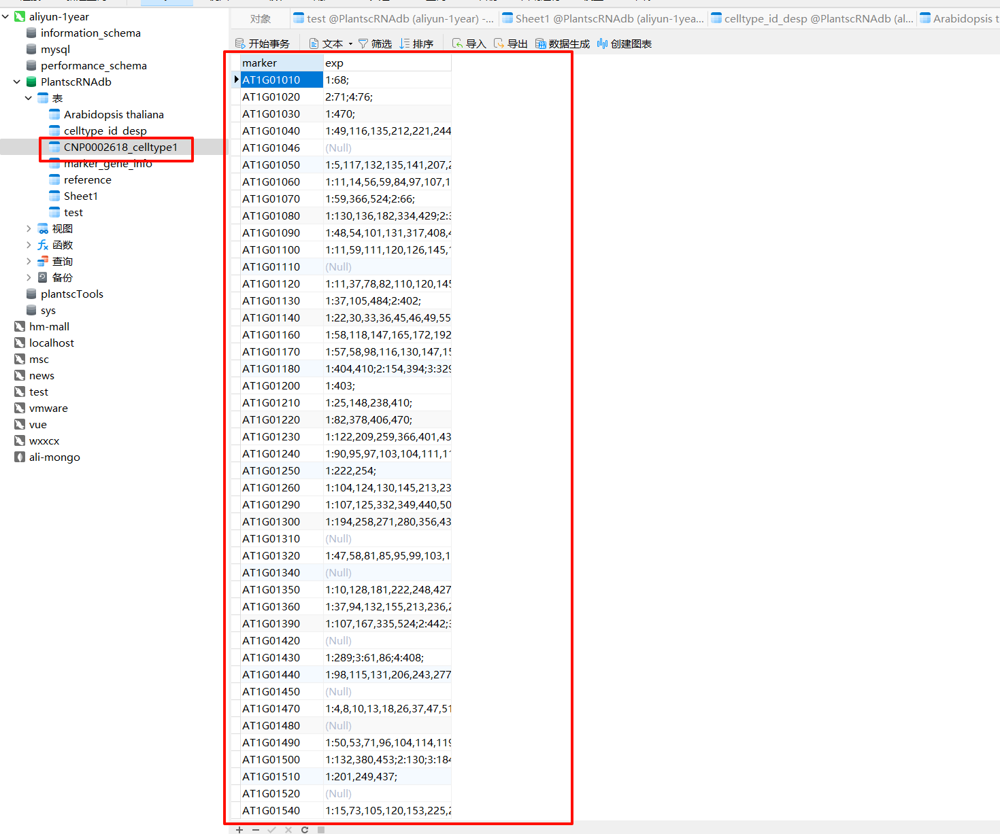

上面这张表通过下面这个文件导入

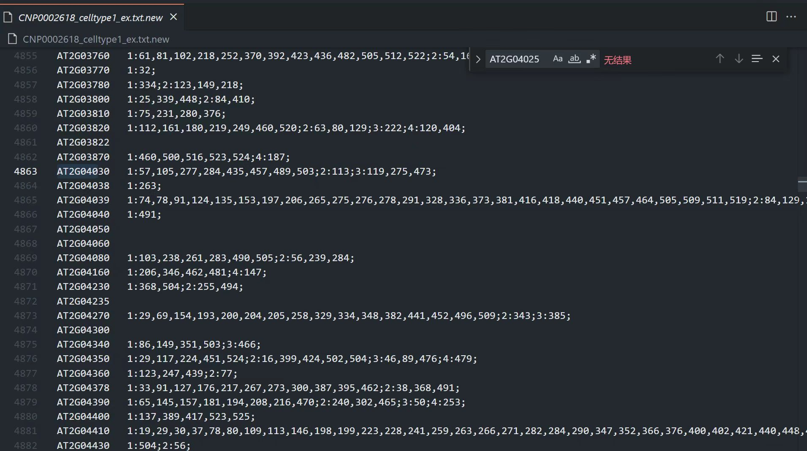

还有相关联的这部分数据

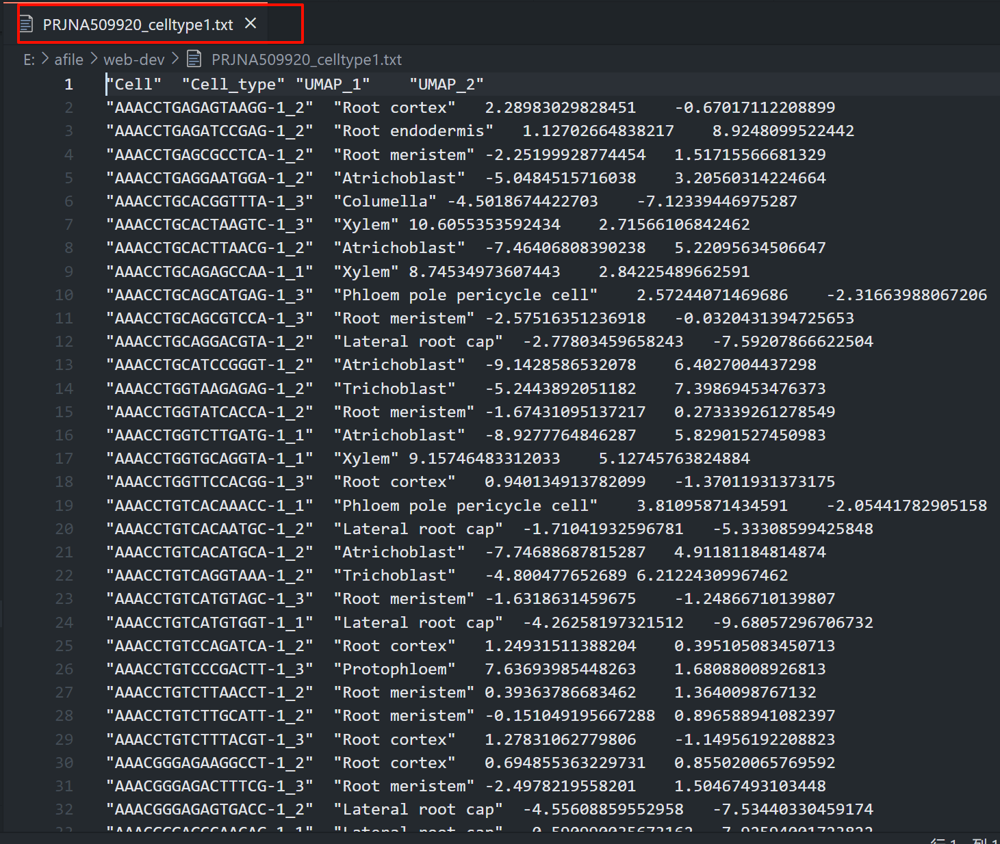

## 5.Refrence和Download

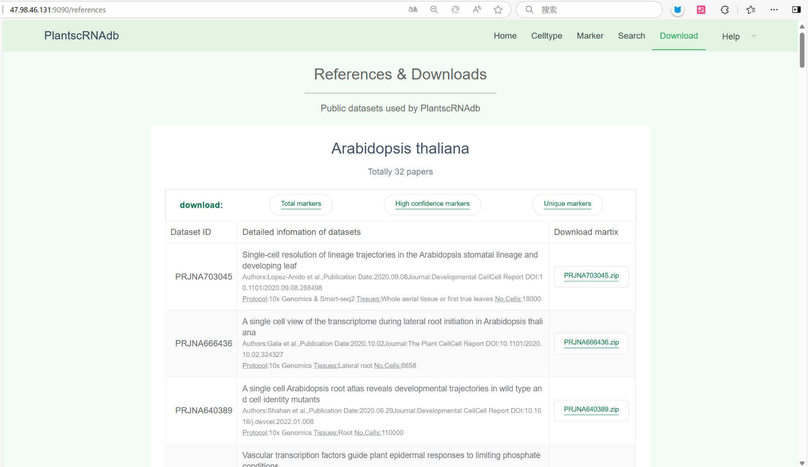

来自这张表

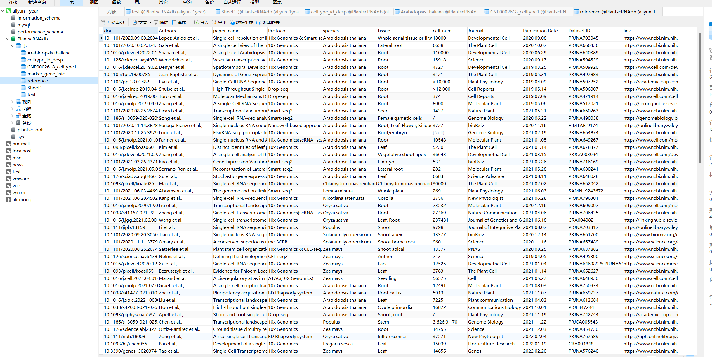
